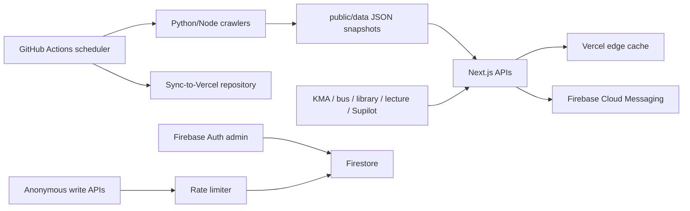

# syu-campus 비-UI 시스템 전수 감사 보고서

- 감사 기준일: 2026-07-19 (Asia/Seoul)
- 대상 커밋: `57f521e02960730d92a7600ff6c0276b6e01d836` (`main`)
- 대상: API 21개 메서드, 서버 유틸리티, 외부 API 연동, Python/Node 크롤러, 정적 데이터, Firebase/Firestore/FCM, 인증·관리자 기능, GitHub Actions, Vercel 연동, 환경 변수, 테스트·의존성
- 제외: 화면 배치, 색상, 타이포그래피, 애니메이션, 사용자 인터페이스의 미적 완성도
- 판정 용어:
  - **확정**: 현재 코드만으로 실패 조건이 성립하거나 로컬에서 재현함
  - **운영 확인**: `https://campus.syu.kr` 응답에서 직접 관찰함
  - **잠재**: 특정 외부 응답·부하·환경 설정에서 발생할 수 있음

## 1. 결론

현재 애플리케이션은 lint, TypeScript 검사, 단위 테스트, 프로덕션 빌드와 npm 보안 감사를 통과했고 주요 공개 API도 응답한다. 그러나 “빌드가 된다”와 “운영 경로가 안전하다”는 동일하지 않다.

즉시 수정해야 할 차단급 문제는 관리자 제출 다건 변경의 Firestore 트랜잭션 순서 위반이다. 모든 읽기가 쓰기보다 먼저 수행되어야 하지만 기존 구현은 항목마다 읽고 즉시 쓴 뒤 다음 항목을 읽었다.

운영 API 대조에서는 동일 버스 노선이 서울·경기 제공처의 이름 표기 차이로 중복됐으며 숫자로 선언된 도착 정보가 빈 문자열로 노출됐다. 두 항목은 예상 위험이 아니라 운영 응답에서 확인된 데이터 계약 결함이다.

초기 감사의 다음 판정은 사용자 운영 의도와 Git 이력을 재확인해 철회했다.

- `actions/checkout@v7`, `actions/setup-node@v7`은 Dependabot PR로 의도적으로 적용된 현재 의존성이다. 존재하지 않는 버전이라는 초기 판정은 잘못됐다.
- 후문 정류장의 `lat/lon`은 현재 시내버스 화면·조회·정렬에 사용되지 않는 응답 메타데이터다. 값의 정확성은 별도 정리 대상일 수 있지만 운영 결함이나 P1이 아니다.
- 금·토 공지를 일일 FCM 대상으로 삼지 않는 것은 주말에 FCM을 보내지 않기 위한 운영 정책이다. 누락 결함으로 분류하지 않는다.

가장 큰 구조적 위험은 다음과 같다.

- 외부 API 대부분에 공통 런타임 스키마, 최대 응답 크기, 공용 stale cache가 없다.
- 공통 공지 크롤러는 HTML 열 순서가 바뀌어 날짜 셀이 비면 실행 당일을 넣고 기본 작성자를 사용해 정상 공지처럼 저장할 수 있다.
- 일일 크롤링이 수집, AI 처리, 데이터 변경, `main` 직접 push를 한 작업에 묶어 놓아 부분 실패 복구와 관측이 어렵다.
- 푸시 발송의 부분 성공 위험은 구독 토큰이 500개를 넘고 뒤쪽 batch가 전체 실패하거나, 발송 후 Firestore 결과 기록이 실패하는 조건에서만 성립한다. 현재 lock은 자동 중복 발송을 막지만 복구에 운영자 판단이 필요하다.
- 테스트 19개 중 crawler·FCM·Firestore 트랜잭션을 직접 검증하는 테스트가 거의 없다.

## 2. 시스템 경계와 조사 범위

검토한 주요 경계는 다음과 같다.

| 영역 | 실제 데이터/코드 경계 |
|---|---|
| 공지 | `public/data/announcements-*.json` → `lib/server/announcements.ts` → `/api/announcements*` |
| 날씨 | KMA 단기실황·초단기예보 → `/api/weather` |
| 대중교통 | 서울·경기 버스 API → `lib/public-transit.ts` → `/api/bus/public-transit` |
| 셔틀 | 외부 위치 API → `/api/bus/shuttle`, 운행 상태는 `lib/shuttle-schedule.ts`와 특수기간 JSON |
| 도서관 | 외부 XML → `/api/library/reading-rooms` |
| 강의시간표 | 외부 JSON → `/api/lecture/timetable` |
| 익명 쓰기 | 문의, 꿀팁, 모임방, 시간표 공유, 알림 구독 → Firestore |
| 관리자 | Firebase ID token + 이메일 allowlist → 제출 조회·수정·AI 분류 |
| 알림 | `user_devices` → FCM batch → 발송 기록·중복 방지 lock |
| 자동화 | 예약 워크플로 → 크롤링/정리/알림/CI → `main` 및 Vercel 동기화 |

## 3. 우선순위별 핵심 발견

| ID | 우선순위 | 판정 | 문제 | 직접 영향 |
|---|---:|---|---|---|
| ADM-01 | P0 | 확정·수정됨 | 관리자 다건 트랜잭션의 read-after-write | 2건 이상 상태 변경 실패 |
| BUS-02 | P1 | 운영 확인·수정됨 | 노선명 기반 병합으로 동일 `routeId` 중복 | 잘못된 도착 목록 |
| BUS-03 | P1 | 운영 확인·수정됨 | 숫자 필드에 빈 문자열 반환 | 런타임 계약 위반·정렬 오류 |
| PUSH-02 | P2 | 조건부 | 500개 초과 batch 또는 발송 후 기록 실패의 진행 상태 부재 | 수동 복구 전 발송 상태 불확실 |
| PUSH-03 | P1 | 확정·수정됨 | 오래된 FCM 토큰 정리 스크립트가 예약 실행되지 않음 | 개인정보·비용·성능 악화 |
| MEET-01 | P1 | 확정 | 모임방 유효성 오류가 400이 아닌 500 | 클라이언트 오판·오류 지표 오염 |
| CRAWL-01 | P1 | 확정/잠재 | 공지 파싱이 누락 날짜를 오늘로 보정하고 일부 경로는 검증 생략 | 잘못된 공지·날짜 생성 |
| CRAWL-02 | P1 | 확정/잠재 | 단일 30분 작업에 수집·AI·push 결합 | 반복 실패·데이터 갱신 정지 |
| EXT-01 | P1 | 잠재 | 외부 응답 공통 스키마·크기 제한·shared stale cache 부재 | 장애 증폭·메모리/비용 위험 |
| WEA-01 | P1 | 확정/잠재 | 예보 선택에서 `fcstDate` 무시 | 자정 전후 과거 예보 선택 |
| LEC-01 | P1 | 확정/잠재 | 시간표 전체 대용량 응답, LKG fallback 없음 | 원천 장애 시 500·전송비 증가 |
| ADM-02 | P1 | 확정 | 통합 관리자 목록이 500건 이후 잘못된 빈 페이지 반환 | 오래된 제출 열람 불가 |
| SEC-01 | P1 | 확정/잠재 | 관리자 권한이 검증 여부 없는 이메일 allowlist 중심 | 잘못 발급된 계정의 권한 상승 |
| ABUSE-01 | P2 | 잠재 | 기존 IP·token 제한을 넘어서는 분산 bot 방어가 없음 | Firestore 비용·스팸·저장소 오염 |
| DATA-01 | P2 | 확정/잠재 | 공지·일정·연락처의 삭제/정정 동기화가 불완전 | 철회 정보 장기 노출 |
| LIB-01 | P2 | 운영 확인/잠재 | regex XML 파서와 좌석 합계 불일치 무표시 | 구조 변경 시 전체 파싱 실패 |
| SHU-01 | P2 | 확정/잠재 | 셔틀 URL에 HTTP 허용, body 무제한, 좌표 범위 미검증 | 도청·메모리·오염 데이터 |
| RATE-01 | P2 | 확정 | process-local limiter map 무기한 증가, 일부 GET만 local 제한 | scale-out 우회·메모리 증가 |
| ENV-01 | P2 | 확정 | workflow와 환경 변수 문서 불일치 | 기능이 조용히 skip되거나 실패 |
| DEP-01 | P2 | 확정 | Python 의존성 보안 감사를 CI가 수행하지 않음 | 공급망 취약점 탐지 공백 |

P0/P1부터 해결해야 한다. P2는 P1 재구현에 함께 포함하면 중복 작업을 줄일 수 있다.

## 4. 상세 발견과 재구현 방법

### ADM-01 — Firestore 다건 트랜잭션 순서 위반

- 근거: `app/api/admin/submissions/route.ts:113`에서 항목을 읽고 `:119`에서 즉시 갱신한 다음 다음 항목을 다시 읽는다.
- Firestore 제약: [트랜잭션은 모든 읽기를 쓰기 전에 수행해야 한다](https://firebase.google.com/docs/firestore/manage-data/transactions).
- 재현: 관리자 PATCH body의 `targets`에 유효한 제출 2개를 넣는다. 첫 항목 update 뒤 두 번째 `get`이 실행된다.
- 적용한 수정:
  1. 모든 `DocumentReference`를 먼저 만든다.
  2. `transaction.getAll(...refs)`로 snapshot을 한 번에 읽는다.
  3. 존재·종류·상태를 전부 검증한 뒤 update loop를 실행한다.
- 남은 검증: 1, 2, 50건과 중간 문서 누락을 Firestore Emulator에서 테스트한다.
- 완료 기준: 일부만 변경되는 경우가 없고, 실패 시 전체 rollback, 50건 처리 성공.

### BUS-02~03 — 운영 대중교통 병합·데이터 계약 위반

- 운영 재확인 시각: 2026-07-19 13:38 KST.
- `jungmun-down` 응답에 같은 `routeId=241339004`가 서울 제공처의 `구리2-2`와 경기 제공처의 `2-2`로 동시에 존재했다. 서울 ARS 정류장 `11155`와 경기 정류장 `110000055`를 같은 `jungmun-down`으로 합칠 때 `routeName`을 우선 키로 사용해 발생한다.
- 평소에는 두 제공처 중 한쪽 응답이 없거나 도착 정보가 짧게 유지돼 화면에서 중복을 보기 어려울 수 있으나 운영 JSON에는 재현됐다.
- 운영 응답의 `predictTime1`, `locationNo1`, `crowded1`이 `""`였지만 TypeScript는 숫자로 선언한다. `predictTime2`와 달리 첫 번째 값은 정규화하지 않는다.
- 서울 저상버스 여부도 `lib/public-transit.ts:232`에서 항상 `false`로 기록한다. 미확인은 false가 아니라 unknown이어야 한다.
- 적용한 수정:
  1. 병합 키를 표시 이름이 아니라 `routeId` 우선으로 통일했다.
  2. `구리2-2` 같은 제공처 지역 접두사를 표시명 normalize 단계에서 제거했다.
  3. 첫 번째·두 번째 도착시간, 정류장 수, 혼잡도, 저상 여부 원본을 공통 finite-number parser로 정규화했다.
  4. 빈 문자열은 0이 아니라 `undefined`로 생략한다.
- 남은 보완: 외부 응답 전체 runtime schema와 서울 low-floor unknown 표현.
- 완료 기준: 같은 routeId 중복 0, 응답 숫자 필드에 문자열 0건, schema validation 통과.

### POLICY-01 — 주말 FCM 미발송은 의도된 정책

- 근거: `.github/workflows/daily-announcement-notification.yml:6`은 UTC 일~목 23시, 즉 KST 월~금 08시에 실행한다.
- `scripts/send-daily-notification.ts:403` 이후는 항상 실행일의 “직전 KST 하루”만 선택한다.
- 운영 의도: 주말에는 FCM을 보내지 않는다. 금·토 공지를 다음 평일 알림에 소급 포함하지 않는 현재 동작도 정책의 일부로 확인했다.
- 판정: 결함·수정 대상에서 제외한다. 정책이 바뀔 때만 집계 구간을 재설계한다.

### PUSH-02 — 부분 발송과 중복 방지 lock의 상태 모델 불일치

- `lib/firebaseMessaging.ts:15-17`은 토큰을 500개 단위로 순차 발송한다. 개별 토큰 실패는 `BatchResponse`에 포함되므로 이 자체로 전체 함수가 throw되지는 않는다.
- 부분 성공이 성립하는 정확한 조건:
  1. 활성 토큰이 500개를 초과한다.
  2. 앞 batch는 FCM에 접수됐다.
  3. 뒤 batch에서 인증·네트워크·서비스 수준 오류로 `sendEachForMulticast` 자체가 throw된다.
- 토큰 수와 무관하게 FCM 발송 후 `notifications_sent` 또는 lock 기록이 실패하는 경우에도 실제 발송과 저장 상태가 달라질 수 있다. `recordNotificationResult`는 발송 뒤 실행되며 sent 문서와 lock을 별도 write한다.
- 현재 안전장치: catch가 lock을 `failed`로 만들고 같은 dedupe key의 자동 재발송을 409로 차단한다. 따라서 자동 중복이 발생하는 구조는 아니다.
- 남은 위험: 운영자가 실제 전달 범위를 확인하지 못한 채 failed lock을 삭제하고 전체 재발송하면 앞서 성공한 대상이 중복 수신할 수 있다. 반대로 lock을 유지하면 뒤쪽 미발송 대상은 누락된다.
- AI가 만든 title/body는 재실행마다 달라질 수 있는데 dedupe key는 날짜 기반이라 같은 key의 request hash가 달라져 409가 날 수 있다.
- 현 구독자 수가 500 이하이고 Firestore 결과 기록 실패가 관찰되지 않았다면 즉시 P1 장애는 아니다. P2 조건부 복원력 항목으로 관리한다.
- 구독자 규모가 500에 근접하거나 실패가 관찰되면:
  1. 요청 수신 시 `notification_jobs` outbox 문서를 만들고 source hash와 확정된 copy를 저장한다.
  2. 토큰을 안정적인 batch ID로 나누고 batch별 `pending/sending/sent/failed`와 FCM 결과를 checkpoint한다.
  3. 재실행은 미완료 batch만 처리한다.
  4. “발송 성공, 기록 실패”를 별도 상태로 두고 reconciliation job이 복구한다.
  5. copy 생성은 outbox 생성 전에 한 번만 하고 재사용한다.
- 완료 기준: 2번째 batch 강제 실패, Firestore 기록 실패, process 재시작 테스트에서 중복이 없고 미완료만 재개.

### PUSH-03 — 오래된 기기 토큰 정리가 예약되지 않음

- 근거: `scripts/cleanup_old_tokens.ts`와 `package.json`의 `cleanup-tokens`는 존재한다. 그러나 `.github/workflows/cleanup-expired-firestore.yml:37`은 `cleanup-expired-firestore`만 실행한다.
- 결과: 명시적 구독 해제나 FCM invalid-token 결과가 오기 전까지 오래된 토큰이 남는다.
- 적용한 수정: 기존 매일 03:30 KST Firestore 정리 workflow에 `npm run cleanup-tokens` 단계를 추가했다. `TOKEN_CLEANUP_DAYS`는 기본 90일, 7~3650 정수만 허용하도록 검증한다.
- 남은 운영 확인: workflow 수동 실행에서 삭제 대상 수와 성공 여부 확인.

### MEET-01 — 입력 오류가 서버 오류로 변환됨

- 근거: `lib/meet.ts:17`의 `normalizeMeetRoomInput`은 plain `Error`를 던지고, `app/api/meet/rooms/route.ts:67`의 `apiErrorResponse`는 알 수 없는 오류를 500으로 처리한다.
- 재현: 빈 제목, 잘못된 날짜/시간 범위를 POST한다.
- 재구현: validator가 구조화된 field error를 반환하거나 `ApiError(400, code, message)`를 던지도록 통일한다. body의 nickname도 `String(object)` 변환 대신 `typeof === "string"`을 먼저 검사한다.
- 완료 기준: 모든 사용자 입력 실패가 400/422, 서버·Firestore 실패만 5xx.

### CRAWL-01 — 공지 크롤러가 구조 변경을 정상 데이터로 위장할 수 있음

- “정상 데이터로 오인”의 정확한 의미는 다음과 같다.
  1. `extract_notice_row`는 링크가 들어 있는 열을 제목 열로 찾는다.
  2. 바로 다음 열을 작성자, 그 다음 열을 날짜라고 위치로 가정한다.
  3. 학교 HTML에 열이 추가·삭제되거나 순서가 바뀌어 날짜 셀이 비면 `datetime.now()`의 실행일을 날짜로 넣는다.
  4. 작성자 셀도 비면 `삼육대학교`, `학생생활팀`, `장학팀` 같은 source 기본값을 넣는다.
  5. 학사·장학·캠퍼스·행사 공통 `crawl_notice_board`는 기존 파일을 읽을 때만 `is_valid_notice_item`을 적용하고 새 `row_data`에는 적용하지 않는다.
- 따라서 selector가 완전히 깨지면 첫 페이지 0건으로 실패하지만, 제목 링크만 남고 열 구조만 바뀌는 “부분 파손”에서는 실제 날짜·작성자가 없는 행이 오늘 등록된 정상 공지처럼 JSON에 들어갈 수 있다.
- 부서 공지 crawler는 새 행에도 `is_valid_notice_item`을 적용하므로 이 특정 문제의 범위는 공통 학사·장학·캠퍼스·행사 경로다.
- URL canonicalization이 query 전체를 제거하면 query parameter가 공지 ID인 게시판에서 서로 다른 글을 한 건으로 합칠 수 있다.
- 첫 페이지에 신규 비고정 글이 없으면 더 깊은 페이지 탐색을 중단하여 수정된 글이나 backfill을 놓칠 수 있다.
- 재구현:
  1. 날짜·제목·URL을 필수로 하고 누락 시 fail closed로 reject한다. 현재 날짜를 만들지 않는다.
  2. source별 HTML fixture와 selector 계약을 버전 관리한다.
  3. 최소 건수, 전일 대비 급감률, 날짜 범위, URL 중복률을 commit 전 검사한다.
  4. query identity parameter는 source별 allowlist로 보존한다.
  5. 마지막 N페이지 또는 N일 overlap을 매번 재수집하고 내용 hash로 수정도 감지한다.
  6. reject 건수와 원인, selector 적중률을 artifact/알림으로 남긴다.

### CRAWL-02 — 일일 크롤링 단일 실패 도메인

- `.github/workflows/crawl-daily.yml`은 30분 안에 여러 Python crawler와 공지 AI 처리를 순차 실행하고 최종적으로 `main`에 직접 push한다.
- AI 상세 페이지 25건, 각 요청 timeout/retry 조합은 남은 작업 전체를 굶길 수 있다.
- workflow 단위 concurrency만 있어 월간 crawler·사람의 push·다른 bot 작업과 `main` 경쟁이 가능하다.
- GitHub는 [정각 부근 scheduled workflow가 지연되거나 일부 유실될 수 있음](https://docs.github.com/en/actions/how-tos/troubleshoot-workflows)도 명시한다.
- 재구현:
  1. source별 수집 job → JSON artifact.
  2. schema/diff 검증 job → 승인 가능한 snapshot.
  3. AI enrichment job은 authoritative crawl과 분리하고 실패해도 원문 snapshot은 배포.
  4. publish job 한 곳만 shared `data-update` concurrency를 잡고 최신 `main`에 rebase/retry.
  5. 직접 push보다 bot branch + 자동 PR 또는 별도 데이터 저장소/object storage를 우선한다.
  6. cron을 정각에서 7~17분으로 옮기고 freshness monitor를 별도로 둔다.
- 완료 기준: 한 source/AI 실패가 다른 source 갱신을 막지 않고, 재실행 시 성공 artifact를 재사용.

### WEA-01 — 자정 경계와 “가짜 정상값”

- `app/api/weather/route.ts:151-161`은 `fcstTime`만 비교하고 `fcstDate`를 사용하지 않는다. 23시대에 목표 시간이 `0000`이면 같은 날짜의 과거 00시 예보를 선택할 수 있다.
- `:169-171`은 기온·강수·풍속이 없을 때 모두 0을 사용한다. provider 부분 응답이 “0°C, 맑음/무강수, 무풍”처럼 보일 수 있다.
- 재구현:
  1. `fcstDate + fcstTime`을 KST instant로 파싱해 목표 이후의 최소 instant를 선택한다.
  2. T1H 같은 핵심 필드는 필수로 하고 누락 시 partial/stale로 처리한다.
  3. 선택 필드는 nullable로 유지하며 0을 fallback으로 쓰지 않는다.
  4. 마지막 정상 응답을 shared cache에 보존하고 source timestamp/age를 노출한다.
- 완료 기준: 23:30~00:30 table test와 부분 응답 fixture 통과.

### EXT-01 — 외부 API 공통 방어 계층 부재

- 셔틀은 `http:`와 `https:`를 모두 허용하고 응답 chunk를 제한 없이 합친다.
- 도서관은 XML을 정규식과 고정 tag 순서로 파싱한다.
- 강의시간표, KMA, Supilot 상세 HTML/JSON도 endpoint별 schema와 byte cap이 일관되지 않다.
- process memory cache는 serverless instance마다 따로 존재해 cold start·scale-out 때 upstream 호출이 증폭된다.
- 재구현할 공통 `externalFetch` 계약:
  - HTTPS와 host allowlist
  - connect/overall timeout + 제한된 retry/jitter
  - redirect 거부 또는 최종 host 재검증
  - Content-Type과 Content-Length 사전 검사
  - stream byte cap
  - runtime schema validation
  - shared last-known-good cache와 `fresh/stale/partial/unavailable`
  - provider, latency, status, schema rejection, cache age metric

### LEC-01 — 강의시간표의 대용량 단일 응답과 무 fallback

- 2026-07-19 운영 응답은 200이었지만 전체 시간표가 한 번에 반환되고 응답 크기가 약 166 KB 이상이었다. Vercel edge cache HIT는 확인됐다.
- route의 메모리 cache 외에 원천 장애 시 last-known-good snapshot이 없어 cache가 없는 instance는 500을 반환한다.
- 동일 강의번호를 병합할 때 교수명 외 서로 다른 시간·장소가 충돌하면 조용히 한 행으로 합칠 가능성이 있다.
- 재구현:
  1. 예약 수집으로 versioned snapshot을 만든다.
  2. schemaVersion, sourceUpdatedAt, generatedAt, checksum을 포함한다.
  3. metadata와 학과/페이지 chunk를 분리하고 ETag/conditional GET을 지원한다.
  4. course identity를 강의번호 단독이 아닌 source의 안정 ID 또는 충돌 검출 composite key로 바꾼다.
  5. 새 snapshot 검증 실패 시 이전 snapshot을 계속 제공한다.

### LIB-01 — 도서관 XML 구조와 합계 의미를 검증하지 않음

- 2026-07-19 운영 응답의 한 열람실은 `total=188`, `used=2`, `remain=184`로 2석 차이가 있었으나 fresh로 표시됐다. 예약·고장 좌석일 수 있지만 현재 계약에는 원인/상태가 없다.
- 정규식은 tag 순서나 CDATA 형식이 바뀌면 유효 데이터를 잃을 수 있다.
- 재구현: 표준 XML parser와 source room ID를 사용하고, 음수·합계 invariant를 검사한다. 불일치는 값을 조작하지 말고 `partial`과 diagnostic code로 노출한다.

### SHU-01 — 셔틀 위치 upstream 방어 부족

- `app/api/bus/shuttle/route.ts:81`은 HTTP도 허용하고 `:109-117`은 body를 무제한 buffer한다.
- `lat/lon`은 문자열 존재 여부만 보고 범위·수치성을 확인하지 않는다. `status`, `routeid`도 유한 숫자면 enum으로 type cast한다.
- 고정 브라우저 client-hint/User-Agent는 upstream 정책 변경 때 403을 유발할 수 있다.
- 재구현: HTTPS 강제, 허용 host 고정, byte cap, JSON schema, 위·경도 범위, enum whitelist, 최소 필수 header만 사용한다. 운행 기간 밖에는 upstream 조회 없이 schedule-aware empty response를 cache할 수 있다.

### ADM-02 — 관리자 통합 목록의 500건 절단

- `app/api/admin/submissions/route.ts:179`은 collection별 읽기를 `min(page*limit, 500)`으로 제한한 뒤 전체 병합 결과를 offset slice한다.
- `totalPages`는 실제 aggregate count로 계산되지만 offset이 500 이상이면 읽은 데이터 밖이므로 빈 페이지가 된다.
- 상태별 total 계산도 두 collection에 반복 aggregate query를 실행해 목록 한 번에 다수의 Firestore read를 유발한다.
- 재구현: 두 collection cursor를 함께 보존하는 composite cursor pagination 또는 통합 `admin_submissions` projection collection을 사용한다. 상태 count는 write-time counter 또는 짧은 cache로 분리한다.

### SEC-01 — 관리자 신원 경계

- 현재 테스트는 `email_verified: false`인 allowlist email도 허용하는 동작을 명시한다.
- 이메일 문자열만으로 권한을 결정하면 잘못 provision된 계정이나 인증 정책 약화가 바로 관리자 권한으로 이어진다.
- 재구현 우선순위:
  1. `email_verified === true`와 허용 provider를 요구한다.
  2. 이메일보다 Firebase UID 또는 admin custom claim을 권한 원장으로 사용한다.
  3. 관리자 계정 MFA와 주기적 권한 검토를 적용한다.
  4. 권한 변경·일괄 상태 변경·AI 분류를 audit log에 남긴다.

### ABUSE-01 / RATE-01 — 익명 쓰기와 rate limiting

- 문의, 꿀팁, 모임, 시간표 공유, 구독은 인증 없이 쓸 수 있지만 현재도 body 크기 제한, 입력 정규화, same-origin 검사, process-local 선제 제한과 Firestore persistent IP 제한을 사용한다. 알림 구독은 token 단위 제한도 있다.
- `lib/server/http.ts`의 process-local bucket은 인스턴스별이라 scale-out으로 우회 가능하고 unique key를 제거하는 TTL/LRU가 없다.
- 모임방 GET은 `persistent:false`라 무작위 ID scan이 분산 인스턴스에서 Firestore 비용을 만들 수 있다.
- Origin이 없는 요청은 허용되므로 same-origin 검사는 bot/API 방어가 아니다.
- 판정: 무방비 상태는 아니다. 보완 대상은 분산 botnet·IP 순환과 읽기 비용 공격이다.
- 재구현: endpoint별 장기 quota, negative cache, abuse metric을 우선 적용하고 실제 스팸 지표가 있거나 비용 임계치를 넘으면 App Check/Turnstile을 단계적으로 적용한다. 플랫폼이 보장한 client IP header만 신뢰한다.

### DATA-01 — 삭제·정정·철회 동기화 부족

- 공지와 일정은 기존 데이터를 계속 병합해 원문에서 삭제·철회되거나 제목/날짜가 정정된 항목이 남을 수 있다.
- 일정은 title/date 변경이 새 일정으로 보이고 기존 일정은 유지될 수 있다.
- 전화번호는 월 1회 갱신이며 건수 절반 이하일 때만 실패하므로 잘못 파싱된 원문 문자열과 설명 변경을 충분히 구분하지 못한다.
- 재구현: source snapshot과 archive를 분리하고 stable source ID, content hash, `active/retracted/updated`, `firstSeenAt/lastSeenAt`을 둔다. 삭제는 2회 연속 미관찰 후 tombstone하는 등 source별 정책으로 처리한다.

### ENV-01 / DEP-01 — 환경·공급망 관리 공백

- `crawl-daily.yml`은 event/department URL 변수와 `SUPILOT_API_KEY`를 사용하지만 환경 등록 문서는 일부 crawler 변수와 공용 AI key를 완전하게 열거하지 않는다.
- AI key가 없으면 summary script는 실패 대신 skip하고 workflow는 성공할 수 있다.
- 문서는 Node 22.12 이상이라고 쓰지만 `package.json`은 22.13 이상을 요구한다.
- npm audit은 CI에 있지만 Python `requirements.txt`에 대한 `pip-audit`가 없다.
- 재구현:
  1. typed env manifest 하나에서 `.env.example`, workflow preflight, 운영 문서를 생성한다.
  2. 각 변수에 required/optional, owner, environment, secret 여부, 검증 규칙을 둔다.
  3. optional AI skip도 workflow summary와 metric에 degraded 상태로 남긴다.
  4. `pip-audit -r requirements.txt`, action SHA pinning, SBOM 생성을 CI에 추가한다.

## 5. 추가 중간 우선순위 발견

다음은 즉시 장애는 아니지만 위 재구현 범위에 포함해야 한다.

1. `normalize_notice_url`과 AI metadata URL canonicalization이 query를 제거해 query-ID 게시판에서 collision을 만들 수 있다.
2. AI metadata의 모델명이 `claude-sonnet-4-6`으로 하드코딩돼 실제 Supilot 모델과 provenance가 어긋날 수 있다.
3. 공지 원문은 외부의 신뢰하지 않는 입력인데 AI prompt에 직접 들어간다. prompt injection 방어, 출력 사실 대조, 개인정보 최소화가 필요하다.
4. 관리자 AI 분류의 redaction은 이메일·전화·일부 숫자만 다뤄 이름, 주소, 학번 등 개인정보가 전달될 수 있다.
5. 관리자 AI 분류에는 사용자별 비용 제한이 없다.
6. 문의·제보 normalize가 긴 입력을 조용히 `slice`하면 사용자는 전체 내용이 저장됐다고 오해한다. 400과 필드별 최대 길이를 반환해야 한다.
7. 시간표 공유는 course ID가 현재 강의 dataset에 실제 존재하는지 검증하지 않는다.
8. 모임 참가 nickname에 객체를 보내면 `[object Object]`가 될 수 있고 availability 누락이 빈 응답으로 덮어쓸 수 있다.
9. 모임 링크를 아는 누구나 참가자 nickname과 가능 시간을 읽는다. 선택적 access code와 최소 공개 범위를 고려해야 한다.
10. `notifications_sent`, `notifications_scheduled`, 문의·제보의 운영상 보존/삭제 작업과 SLA가 코드로 확인되지 않는다.
11. 부모 `meet_rooms`를 먼저 지우면 하위 participants는 자동 삭제되지 않는다. 문서에는 collection-group TTL이 명시돼 있으므로 실제 Console 정책과 orphan audit을 운영 점검해야 한다.
12. Firebase web 초기화는 일부 필수값만 사전 검사해 messaging 관련 누락이 늦게 드러날 수 있다.
13. Service Worker activate가 origin의 모든 Cache Storage를 지운다. 소유 prefix만 삭제해야 한다.
14. 공지 `all` 조회의 `Promise.all`은 파일 하나가 깨지면 전체를 실패시킨다. summary/service notice 경로는 반대로 실패를 200 빈 배열로 숨긴다. `allSettled`와 source 상태가 필요하다.
15. 공지와 AI metadata JSON은 서버 cold start에 모두 적재된다. 현재 공지 6,414건, 관련 파일 합계 약 6.75 MB다. build-time index 또는 chunk가 적합하다.
16. cafeteria `lastUpdated`가 timezone 없는 ISO 문자열이다. UTC `Z` 또는 명시적 `+09:00`을 사용해야 한다.
17. cafeteria는 요청한 `week_start`와 화면에 표시된 주가 같은지 확인하지 않는다. upstream cache/query 무시 시 잘못된 주를 저장할 수 있다.
18. department crawler는 부서를 하나도 찾지 못해도 기존 파일을 유지하고 성공할 수 있다. 발견 건수 0은 degraded가 아니라 실패로 처리해야 한다.
19. 대중교통 freshness parser는 offset 없는 문자열을 runtime local time으로 해석한다. provider KST를 `+09:00`으로 명시해야 한다.
20. browser cache와 CDN cache를 분리하려면 `CDN-Cache-Control`/`Vercel-CDN-Cache-Control` 정책을 명시하고 민감 API의 live header를 자동 검사해야 한다.

## 6. 현재 데이터와 운영 API 표본

### 정적 데이터 검사

- 공지: 총 6,414건
  - academic 3,101
  - campus 444
  - scholarship 1,351
  - events 1,422
  - departments 96
- 공지 exact ID 중복 0, exact URL 중복 0, 날짜 형식 오류 0
- AI metadata 3,386건, `generatedAt=2026-07-17T16:27:14.880Z`
- 학사 일정 83건, 중복 key/ID 0, 잘못된 날짜 범위 0
- 학식 파일 `weekStart=2026-07-13`, 현재 주 전체 휴무, `lastUpdated=2026-07-18T01:22:49.433612`로 timezone 없음
- 셔틀 특수기간상 2026-07-19는 운행 기간 밖이므로 운영 shuttle API의 빈 배열은 정상

### 운영 API 확인

| API | 결과 | 관찰 |
|---|---|---|
| `/api/weather` | 200, fresh | 28°C, 강수 0, 풍속 0.6, Vercel cache HIT |
| `/api/bus/public-transit` | 200, fresh | `routeId=241339004`가 `구리2-2`/`2-2`로 중복, 숫자 필드 빈 문자열 |
| `/api/bus/shuttle` | 200, fresh, `data=[]` | 주말·운행 기간 밖이라 정상 |
| `/api/library/reading-rooms` | 200, fresh | 7개 열람실, 한 항목의 total-used-remain 합계 불일치 |
| `/api/lecture/timetable` | 200 | 2026년 2학기, 대용량 전체 dataset, edge HIT |

운영 표본은 특정 시각의 관찰이며 provider 전체 계약을 증명하지 않는다. 그래서 fixture와 runtime schema가 필요하다.

## 7. 검증 결과

| 검증 | 결과 | 비고 |
|---|---|---|
| `npm run lint` | 통과 | `npm run check` 내부 |
| `npm run type-check` | 통과 | `npm run check` 내부 |
| `npm run check:i18n` | 통과 |  |
| `npm run check:unused` | 통과 | knip |
| Python 문법 검사 | 통과 | bundled Python으로 13개 script 검사 |
| `npm run check:graduation` | 통과 | source 6, 조합 24, 학과 규칙 4 |
| `npm run check:curriculum` | 부분 통과 | 원본 PDF 2개가 checkout에 없어 hash 검사는 skip, JSON 3,140건 검증 |
| `npm run test:unit` | 통과 | 6 files, 19 tests |
| `npm run build` | 통과 | sandbox 외 프로덕션 빌드, 57 pages |
| `npm audit --audit-level=moderate` | 통과 | 0 vulnerabilities |
| `git diff --check` | 통과 | 보고서 작성 전 기준 |

`npm run check` 자체는 Windows PATH에서 `python`을 찾지 못해 Python 단계에서 중단됐다. 동일 검사 스크립트를 bundled Python으로 실행해 통과했으며 나머지 검사와 build는 개별 완료했다. 이는 코드 실패가 아니라 로컬 실행 환경 차이다.

단위 테스트는 통과했지만 현재 테스트 범위는 좁다. API route, crawler HTML fixture, Firestore emulator, FCM batch, 외부 API schema/timeout/fallback을 다루는 테스트가 사실상 없다.

## 8. 권장 재구현 순서

### 0단계 — 즉시 복구

1. 관리자 bulk PATCH를 `getAll → validate → update` 구조로 수정했다.
2. 대중교통 병합을 routeId 우선으로 바꾸고 빈 문자열 숫자 계약을 수정했다.
3. 오래된 FCM 토큰 정리를 기존 예약 workflow에 추가했다.
4. 위 변경을 unit/type/lint/build로 검증하고 Firestore Emulator·workflow 수동 실행을 별도 운영 검증한다.

### 1단계 — 1주 내 안전성

1. 활성 토큰이 500개에 근접하거나 실제 부분 실패가 관찰되면 notification outbox와 batch checkpoint를 도입한다.
3. meet validation 500, 관리자 500건 pagination을 수정한다.
4. 관리자 `email_verified`/UID 권한과 익명 write abuse 방어를 강화한다.
5. KMA 자정 선택과 critical-field fallback을 수정한다.
6. API·Firestore emulator·crawler fixture 테스트를 CI에 추가한다.

### 2단계 — 수집·외부 연동 재설계

1. 공통 `externalFetch + runtime schema + LKG cache` 계층을 만든다.
2. crawler를 source artifact, validation, enrichment, publish로 분리한다.
3. snapshot에 checksum, schemaVersion, sourceUpdatedAt, freshness를 표준화한다.
4. 공지·일정·전화의 update/retract/tombstone 모델을 도입한다.
5. env manifest와 Python 공급망 감사를 자동화한다.

### 3단계 — 운영 관측과 SLO

- source별 마지막 성공 시각과 데이터 age
- 새 항목 수, reject 수, 전일 대비 급감률
- 외부 API latency/status/schema reject/cache hit
- notification job/batch 상태와 중복률
- Firestore write/read 수, limiter reject 수, anonymous abuse score
- “자동화 성공”이 아니라 “최종 데이터 freshness와 배포 SHA 일치”를 SLO로 설정

## 9. 필수 테스트 매트릭스

| 영역 | 최소 추가 테스트 |
|---|---|
| Actions | actionlint, Dependabot 변경 후 workflow_dispatch smoke |
| 관리자 | Emulator 1/2/50건 transaction, 누락 문서 rollback, 501건 pagination |
| 대중교통 | 실제 응답 fixture, 숫자/빈 문자열/누락, 서울·경기 동일 routeId 병합, KST timestamp |
| 날씨 | 23:30/00:00 경계, fcstDate 전환, 부분 payload, provider 5xx stale fallback |
| 크롤러 | source별 HTML fixture, selector 0건, 날짜 누락, query-ID URL, 건수 급감 |
| 알림 | 주말 미발송 정책, AI copy 재실행, 2번째 FCM batch 실패, 기록 실패 후 재개 |
| 익명 쓰기 | body 크기, 타입 오류, 분산 limiter, bot challenge, quota |
| Firestore | TTL/orphan participants, token cleanup dry-run, retention audit |
| 강의/도서관/셔틀 | schema 변경, oversized body, 잘못된 content-type, timeout, LKG |

## 10. 감사 한계

- 실제 Firebase 운영 데이터와 Console TTL 정책은 변경하거나 열람하지 않았다.
- 관리자·익명 쓰기 API에 운영 데이터를 만드는 파괴적 요청은 보내지 않았다.
- KMA/버스/도서관/강의 upstream 원문 전체 계약은 공개 endpoint의 운영 응답과 코드로 대조했으며, 모든 provider 변형을 수집한 것은 아니다.
- 환경 변수의 실제 secret 값은 확인하지 않았고 이름·사용 경계만 감사했다.
- GitHub combined commit status와 commit workflow 조회는 연결된 조회에서 비어 있었다. 다만 Git 이력에서 `checkout@v7`은 Dependabot PR #38, `setup-node@v7`은 PR #83으로 적용된 사실을 확인했으므로 action 버전 오류 판정은 철회했다.
- curriculum 원본 PDF 2개가 checkout에 없어 hash 검증은 수행되지 않았다.

## 11. 완료 판정 기준

본 감사에서 제시한 “재구현 완료”는 코드 변경만을 뜻하지 않는다.

1. P0/P1 수정에 회귀 테스트가 있어야 한다.
2. 모든 GitHub workflow가 같은 최종 commit에서 성공해야 한다.
3. crawler가 만든 snapshot의 schema/diff/freshness 검사가 통과해야 한다.
4. 운영 API에서 BUS-02~03이 사라지고 runtime schema가 통과해야 한다.
5. FCM 부분 실패 주입 테스트에서 중복 없이 재개돼야 한다.
6. Firestore Emulator에서 bulk transaction과 pagination이 경계값을 통과해야 한다.
7. 변경 후 `npm run check`, unit/integration test, production build, npm/pip audit가 모두 통과해야 한다.

이 기준을 충족하기 전에는 “문제 목록 처리”와 “운영 안전성 확보”를 같은 것으로 간주하면 안 된다.
